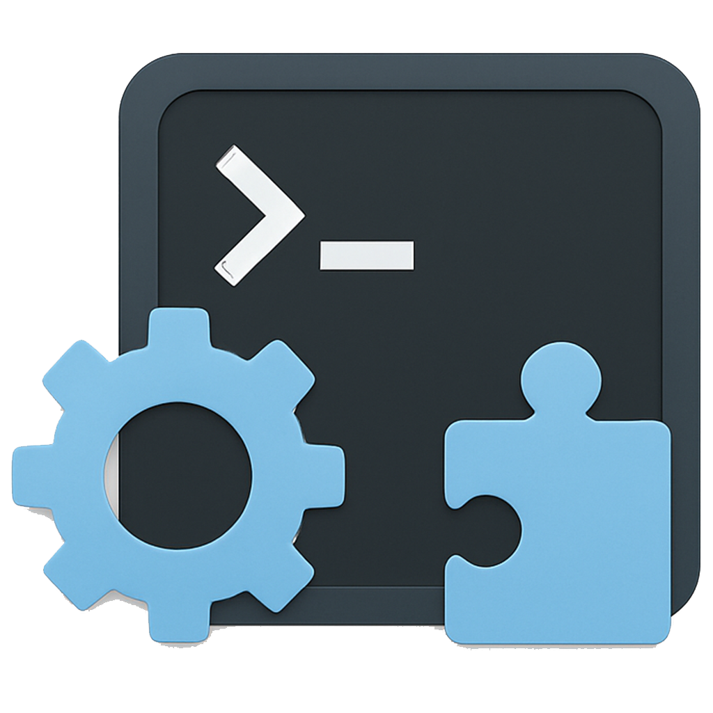

<p align="center">
  <p align="center">
    
  </p>
  <h1 align="center"><b>InjectHub</b></h1>
  <p align="center">
    <a href="README.md">English</a>
    <br />
    <br />
    
    
    
    <br />
    <a href="https://t.me/NKR00711"></a>
    <a href="https://t.me/FreeIDMZone"></a>
    <a href="https://t.me/FreeIDMZoneC"></a>
  </p>
</p>

# InjectHub

InjectHub is a powerful macOS utility designed to inject dynamic libraries (`.dylib`) into apps or binaries with ease. It provides a clean, native UI built using Swift and SwiftUI, offering tools for developers, researchers, and enthusiasts who need flexible and safe binary injection workflows.

---

## 🎯 Features

- 💉 **One-Click dylib Injection**  
  Select a `.dylib` and a target app/binary — InjectHub handles the rest.

- 🧠 **Auto Target Detection**  
  Automatically locates executable files inside `.app` bundles for injection.

- 🗃 **Saved Apps Panel**  
  Save your injected apps with metadata like Bundle ID, paths, and dylib info. Easily reload configurations with one click.

- 🔒 **Secure Root Handling**  
  Uses AppleScript securely to run privileged commands when needed. Optionally store the root password in Keychain.

- 📋 **Live Console Logs**  
  See real-time feedback of every operation with options to copy or clear logs.

- 🧪 **Advanced Settings**  
  - Strip Code Signature  
  - Skip Backup  
  - Dummy Sign  
  - Auto Dequarantine  

- 📦 **Backup & Restore**  
  InjectHub creates backups before modifying targets. Restore anytime with a single click.

- 🔄 **Update System**  
  Built-in update checker with support for direct `.app` updates hosted online (e.g. GitHub).

---

## 🛠 Requirements

- macOS 15.5+  
- Inserted dylibs must be compatible with the target architecture

---

## 📦 Installation

1. **Download** the latest `.app` release from the [Releases](https://github.com/NKR00711/InjectHub/releases) page.
2. Move `InjectHub.app` to your `/Applications` folder.
3. If the app is quarantined by Gatekeeper, run:

```bash
xattr -cr /Applications/InjectHub.app
```
## 🙏 Acknowledgements

Thanks to the following amazing projects that made InjectHub possible:

- [`insert_dylib`](https://github.com/Tyilo/insert_dylib) — A utility to inject a dylib into a Mach-O binary.
- [`marlkiller`](https://github.com/marlkiller) — Useful macOS reverse engineering tools and inspiration.
- [`InjectX`](https://github.com/inject-X/injectX) — an application injection tool designed for macOS.

